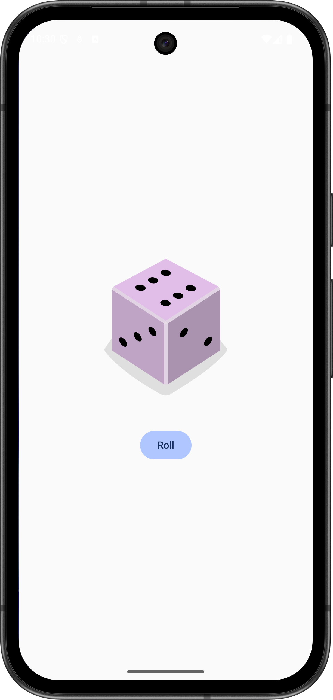

# Dice-Roller 🎲

A simple Android app built with **Jetpack Compose** that simulates rolling a dice. Each tap on the "Roll" button generates a random number from 1 to 6 and displays the corresponding dice face.

## Features 🔧

- Built using **Jetpack Compose**
- Random dice number generation
- Dynamic image updates for each dice face
- Clean and minimal UI

## Purpose ⚙️

This project was created as part of the [Android Basics with Compose](https://developer.android.com/courses/android-basics-compose/course) course by Google, to practice working with:
- State management in Compose
- Image display
- Basic UI interactions

## Screenshots 🖼️

## How to Run ▶️

1. Clone the repository.
2. Open in **Android Studio**.
3. Run the app on an emulator or physical device.

---

Happy rolling! 🎲
